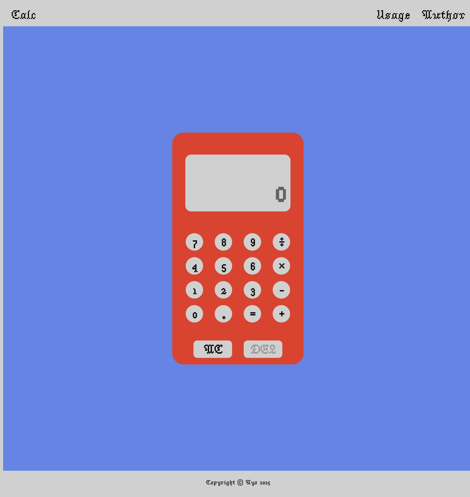

# Web-Based Calculator

A simple, clean, and functional calculator built with vanilla HTML, CSS, and JavaScript as part of [The Odin Project's](https://www.theodinproject.com/) curriculum. It handles basic arithmetic operations and provides a user-friendly interface that supports both mouse and keyboard input.

## Live Preview

Clink the link to view the [Live Preview](https://ayoroq.github.io/calculator/)



## Features

- **Basic Arithmetic:** Perform addition, subtraction, multiplication, and division.
- **Display:** A clear screen to show the current input and results, with a history view for the previous calculation.
- **Decimal Support:** Works with floating-point numbers.
- **Keyboard Support:** Use your keyboard for a faster experience.
  - **Digits (0-9):** `0`, `1`, `2`, `3`, `4`, `5`, `6`, `7`, `8`, `9`
  - **Operators:** `+`, `-`, `*`, `/`
  - **Equals:** `=` or `Enter`
  - **Delete (DEL):** `Backspace`
  - **All Clear (AC):** `Escape` or `Delete`
- **Error Handling:** Gracefully handles division by zero with a friendly message.
- **Chained Operations:** You can string multiple operations together (e.g., `5 * 2 + 10`).

## How to Use

1.  Clone this repository or download the files.
2.  Open the `index.html` file in your web browser.
3.  Use the on-screen buttons or your keyboard to start calculating.

## Project Structure

```
├── index.html      # The main HTML file with the calculator structure
├── style.css       # CSS for styling the calculator (not provided, but linked)
└── calculator.js   # JavaScript for all the calculator logic
```

### `calculator.js` Logic Overview

- **Core Functions:** `add()`, `subtract()`, `multiply()`, `divide()` perform the basic math.
- **`operate()`:** A central function that takes an operator and two numbers, then calls the appropriate core function.
- **DOM Manipulation:** Selects all necessary buttons and display elements from the DOM.
- **State Management:** Uses global variables (`a`, `b`, `operator`, `result`) to keep track of the current calculation state.
- **Event Listeners:**
  - Digit and operator buttons update the state and display.
  - The equals button triggers the `operate()` function to calculate the final result.
  - `AC` (All Clear) and `DEL` (Delete) buttons reset the state or remove the last character.
  - A `keydown` event listener maps keyboard inputs to their corresponding button clicks.

## Technologies Used

- HTML5
- CSS3
- Vanilla JavaScript
